# Water in the soil–plant–atmosphere continuum

A small, complete example of metafspm: steady water flow from a water table, through the soil and seedlings, out to a
dry atmosphere. Every part shows a feature of metafspm:

| file | what it shows |
|---|---|
| `components.py` | **`PlantWaterTransport`** and **`SoilWaterTransport`**, two `FunctionalComponent`s, each declaring its own variables and graph system: a node balance, an edge law given explicitly (j = k ΔΨ), and every boundary written as an equation (`@boundary_condition`): the exchange with the air, k_vap (Ψ_air − Ψ), each selecting its nodes with explicit `filters=` key / values. The plant's are at the Compartment and Connection scales, read from and written to the MTG; it adds the root–soil exchange, an equation of the coupled soil Ψ (`@boundary_condition`). The soil's are at cell and edge locations; it adds the water table (Dirichlet, Ψ − Ψ_table) and the plants' uptake. `@graph_output`s give the uptake and the evaporation. |
| `seedling.py` | **The seedling generator**, standing for the structural models (growth, anatomy) a real simulation would couple: the architecture at every scale (three first-order roots from the collar: a nearly vertical pivot with two laterals on alternate sides, and two roots bending towards the vertical with a gravitropism coefficient, with one lateral each), the anatomies and the axial junctions, with the codes the components read. |
| | **`SeedlingStructure`** (in `components.py`), a `StructuralComponent`: `initiate_plant` builds each seedling (with `seedling.py`) at every scale (Plant → Axis → GrowthUnit → Phytomer → Organ → SubOrgan) with an anatomy per segment (root: epidermis, cortex, endodermis, xylem; stem: epidermis, cortex, xylem; leaf: xylem, mesophyll, stomatal cavity) and the axial xylem junctions, then computes the conductances from the structure: k = k_s · L on radial edges, k = k_axial / L on axial ones. **`SoilStructure`** does the same for the soil grid (k = K · A / d on the faces, K varying between voxels). |
| | **The air**, a constant input: Ψ_air = (RT/V_w) ln RH at 50 % and 20 °C (about −93.9 MPa), and the vapour factor that turns a vapour conductance into a liquid one where water evaporates (the liquid–vapour step, linearised). |
| `models.py` | **Models and translators.** The plant population model (`SeedlingWater`: initiators, anatomy mode) and the soil environment models: `Soil`, and `AdaptiveSoil`, the same components on an adaptive grid. Translators inside a DataStructure (k → conductance), and across DataStructures (soil Ψ → root epidermis, uptake → soil cells). A `CrossMapping` of the root surface only (`mask=`). A `stop_when` condition on the change of Ψ between steps. |
| `one_plant.py` | **A Scene with one seedling**, run until the lagged plant–soil fixed point converges, with a `SceneRecorder`. |
| `one_plant_adaptative.py` | **The same seedling on an adaptive soil** (`AdaptiveSoil`, an `AdaptiveGridDataStructure`), refined where the roots take up water, compared with uniform grids. |
| `population.py` | **A Scene with a planted stand.** `planting_table` lays out the plants, and each plant's root radial conductance comes from its own scenario (`per_plant_scenarios`). |
| `upscaling.py` | **Upscaling** the solved water potentials from the Compartments to the plants, scale by scale (SubOrgan, Organ, Phytomer, GrowthUnit, Axis, Plant), each the mean of the scale below: one derived variable per scale (`ds.derive(..., location=scale, aggregation="mean")`), recomputed when the potentials change. |
| `plotting.py` | **Plots** of the DataStructures and of the converged Ψ: the plants at SubOrgan scale, the full graph with the anatomies, one anatomy per organ type, a soil slice with the roots, a top view of the uptake. |

Run, from this folder:

```
python one_plant.py            # writes to outputs/one_plant
python population.py           # writes to outputs/population
```

Units: water potentials in MPa, volumes in mm³ (fluxes in mm³ s⁻¹, conductances in mm³ s⁻¹ MPa⁻¹), lengths in m.
Volumes in mm³ keep the solves' residuals well above the solver's absolute tolerance.

## One plant

The scene converges in seven steps (largest change of Ψ: 7.8e-01, 1.2e-02, 4.6e-04, 2.6e-05, 1.6e-06, 9.7e-08 MPa). Transpiration
(0.076 mm³ s⁻¹) equals the root uptake and the water taken from the soil; the water table supplies it and the soil
evaporation.


The same views with the soil's ΔΨ (Ψ minus its layer mean, red where drier) behind the plant, on a scale of its own
under the plot, the plant keeping its Ψ scale on the right:

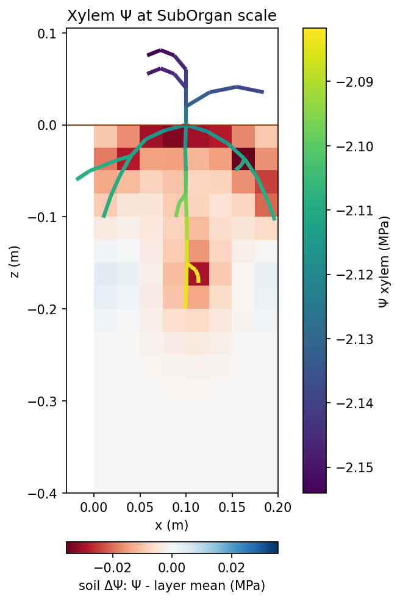
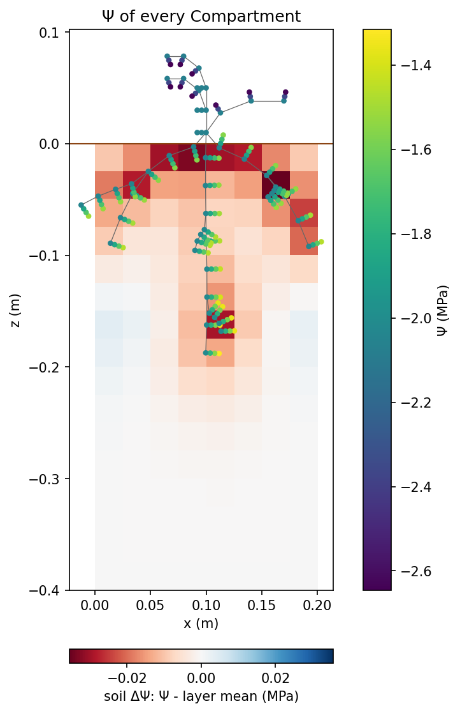


The plain slice is dominated by the vertical gradient, from the water table up to the roots. Ψ minus each layer's
mean shows where the roots deplete the soil:

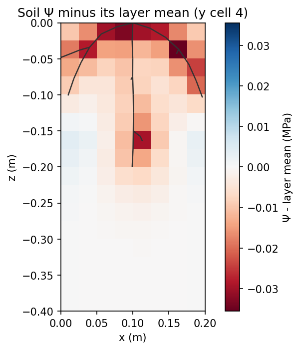


### Upscaling, step by step

The solved potentials of the 180 Compartments are averaged into the 48 segments, then the 13 organs, the 6
phytomers, the 4 growth units, the 4 axes and the plant: every scale of the MPG (`upscaling.py`). Each step is one
`derive`. The figure draws the graph of each scale, side by side at the same spacing: its entities as nodes, coloured by their value, and the links
between them (an edge of the solver graph joining two entities), on one colour scale.

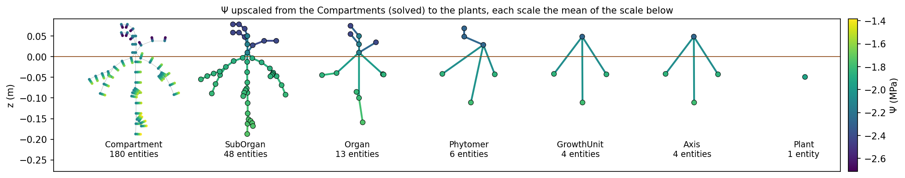

## One plant on an adaptive soil

`one_plant_adaptative.py` runs the same scene on `AdaptiveSoil`: an `AdaptiveGridDataStructure` of 2.5 cm cells,
split down to 0.625 cm (`max_level=2`) where the roots take up water. The components and translators are those of
`Soil`; `SoilStructure` reads the layers and areas from any grid's geometry. After each solve, the model refines the
cells whose **sink density** (uptake per volume) exceeds 5 % of its maximum and coarsens below 0.5 %; the lagged
coupling then settles Ψ and the grid together (two adaptations, then 930, 678 and 592 cells at the three sizes, 2200
in all against 65 536 for the finest uniform grid).

**Why the sink density, not the flux.** A two-point flux is exact for a linear Ψ, whatever the cell size and the flux:
the error comes from where the flux changes. In a steady flow the flux changes where water leaves, i.e. at the sinks.
The water-table column carries large fluxes in coarse cells, where Ψ is nearly linear.

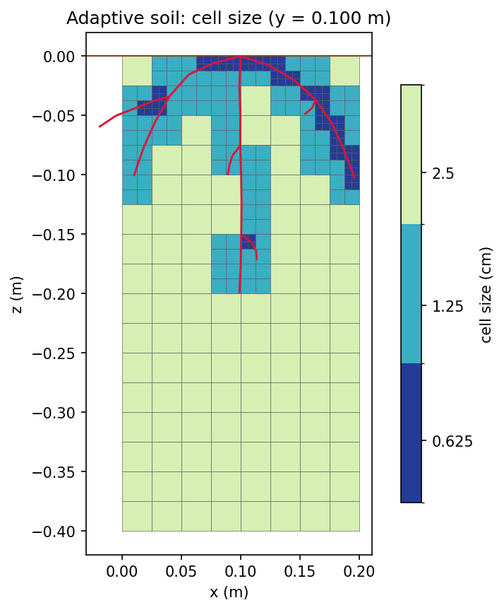
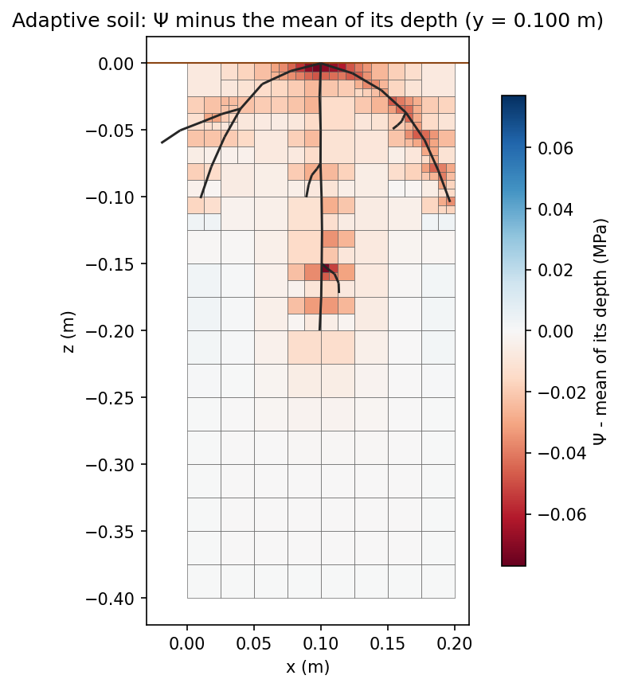
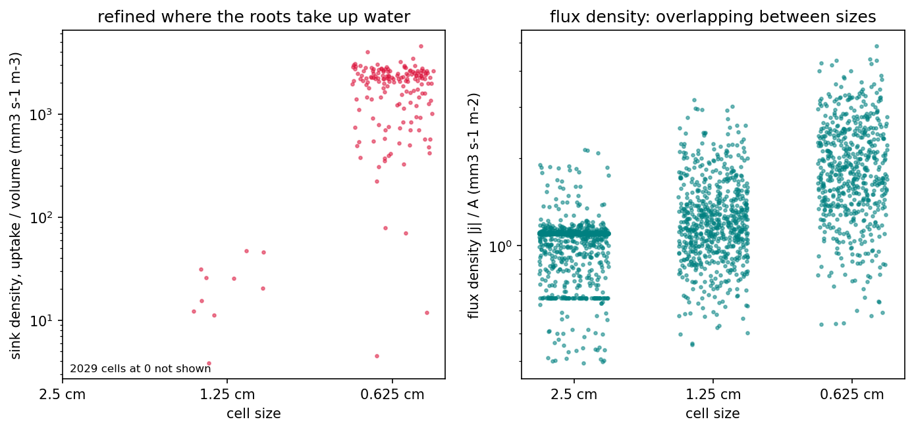

**Accuracy: not yet.** Against the uniform 0.625 cm grid, the depletion near the roots (Ψ minus the mean of its depth,
within 2 cm of a sink) is no better on the adaptive grid than on the uniform 2.5 cm one (0.0074 MPa both). The flux
through a face between cells of different sizes uses only the distance along the face's axis. Across a vertical
interface, the coarse cell's centre is at another depth than its fine neighbours', and the strong vertical gradient
(about 3.5 MPa m⁻¹) adds a spurious flux. A refined horizontal block, whose interfaces are horizontal, does reduce the
error (0.0067 → 0.0004 MPa). See `devplan_adaptive_soil.md` for the fix under discussion.

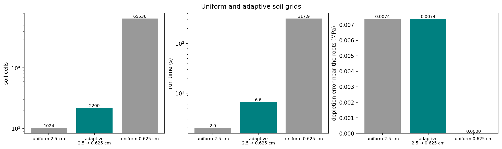

## A population

The plants share the soil; their root radial conductances cycle through 0.4, 0.5 and 0.6. Under a dry air
(Ψ_air ≈ −94 MPa), the vapour step limits the flow, so transpiration varies little between plants. Their leaf water
potentials absorb the difference: the least conductive roots give the lowest leaf Ψ.

The side views show the first planting row (four plants, seen along the row, in the y–z plane).


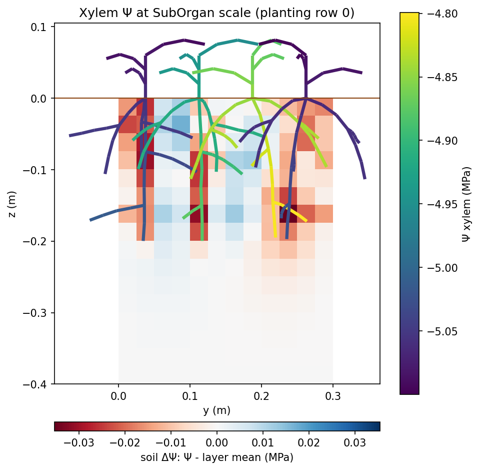

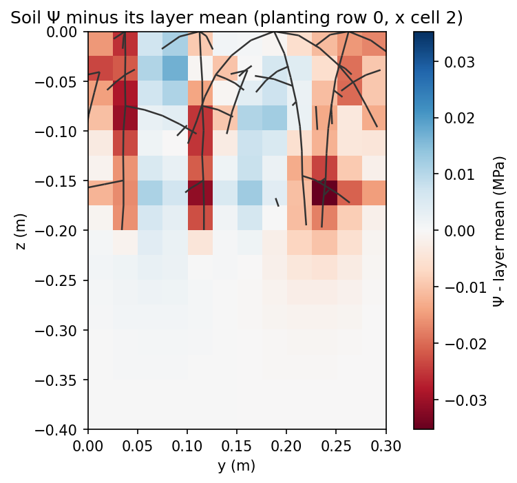


The upscaling of the first row's plants:

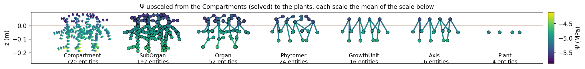

## Notes

- The axial junctions are built by `initiate_plant` with their own properties (type, length). `MPGDataStructure(...,
  wiring=rules)` can wire junctions too, but the Connections it creates carry no such properties.
- The plant–soil coupling is lagged: each scene step solves the soil with the plants' last uptake, then the plants
  with the soil's new Ψ, until `stop_when` holds.
