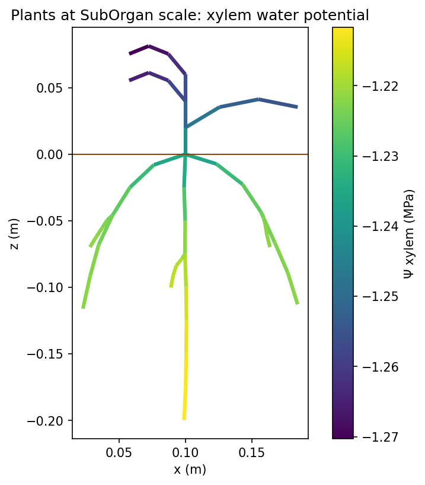
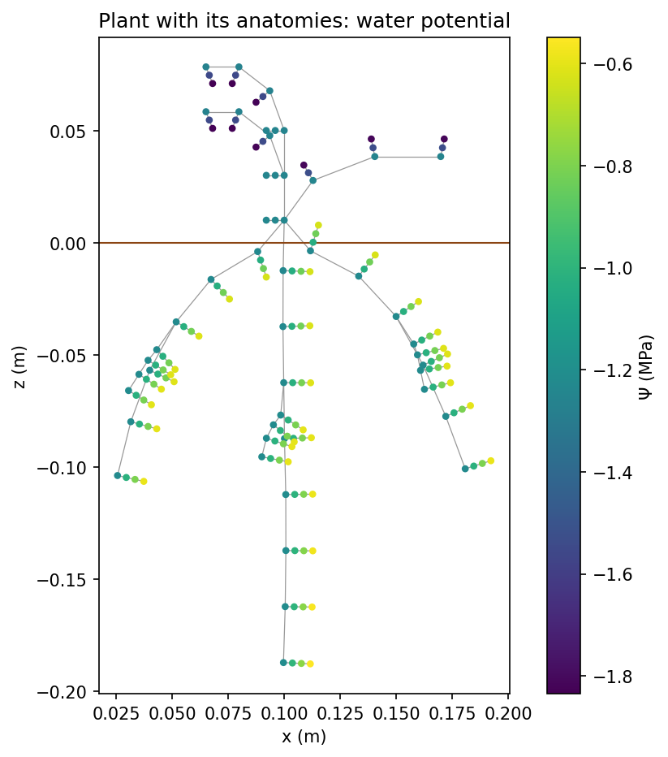
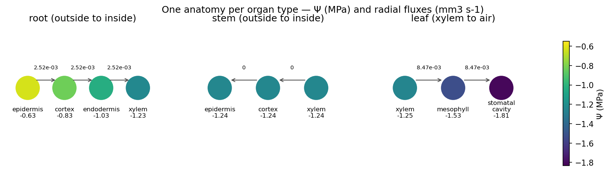
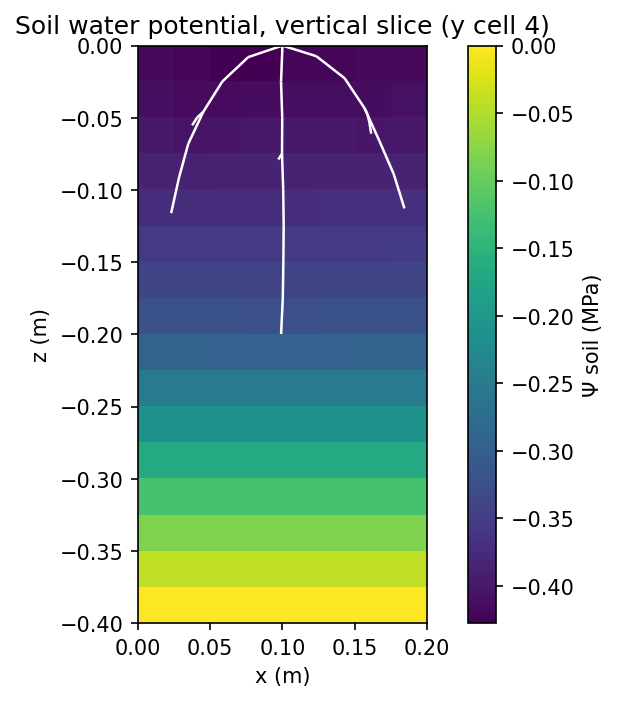
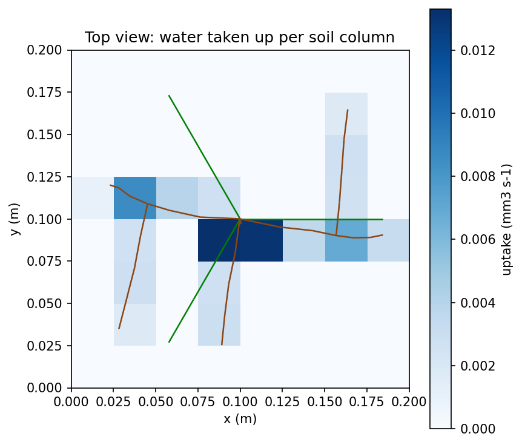
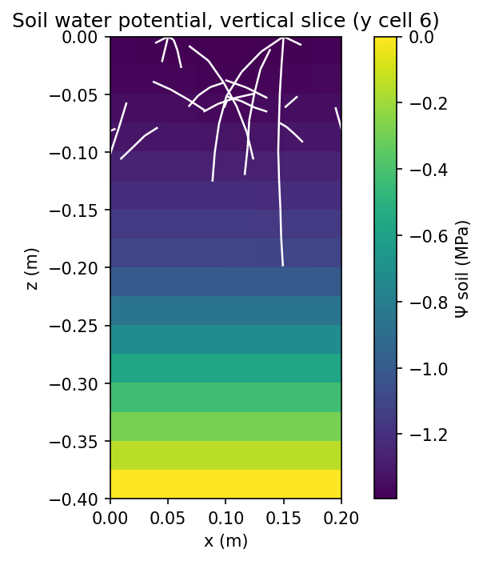
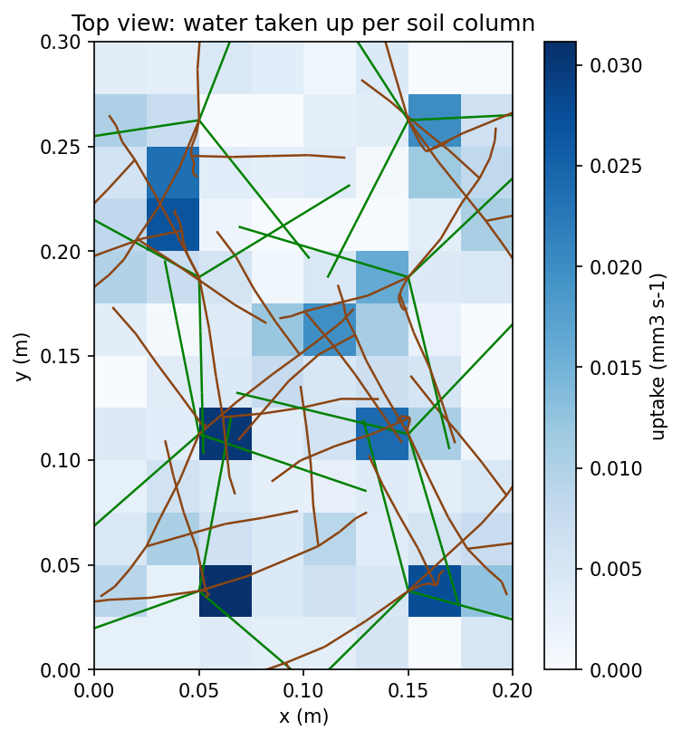

# Water in the soil–plant–atmosphere continuum

A small, complete example of metafspm: steady water flow from a water table, through the soil and seedlings, out to a
dry atmosphere. Every part shows a feature of metafspm:

| file | what it shows |
|---|---|
| `components.py` | **`PlantWaterTransport`** and **`SoilWaterTransport`**, two `FunctionalComponent`s, each declaring its own variables and graph system: a node balance, an edge law given explicitly (j = k ΔΨ), and every boundary written as an equation (`@boundary_condition`): the exchange with the air, k_vap (Ψ_air − Ψ), each selecting its nodes with explicit `filters=` key / values. The plant's are at the Compartment and Connection scales, read from and written to the MTG; it adds the root–soil exchange, an equation of the coupled soil Ψ (`@boundary_condition`). The soil's are at cell and edge locations; it adds the water table (Dirichlet, Ψ − Ψ_table) and the plants' uptake. `@graph_output`s give the uptake and the evaporation. |
| `seedling.py` | **The seedling generator**, standing for the structural models (growth, anatomy) a real simulation would couple: the architecture at every scale (three first-order roots from the collar, each with a lateral: a nearly vertical pivot, and two roots bending towards the vertical with a gravitropism coefficient), the anatomies and the axial junctions, with the codes the components read. |
| | **`SeedlingStructure`** (in `components.py`), a `StructuralComponent`: `initiate_plant` builds each seedling (with `seedling.py`) at every scale (Plant → Axis → GrowthUnit → Phytomer → Organ → SubOrgan) with an anatomy per segment (root: epidermis, cortex, endodermis, xylem; stem: epidermis, cortex, xylem; leaf: xylem, mesophyll, stomatal cavity) and the axial xylem junctions, then computes the conductances from the structure: k = k_s · L on radial edges, k = k_axial / L on axial ones. **`SoilStructure`** does the same for the soil grid (k = K · A / d on the faces, K varying between voxels). |
| | **The air**, a constant input: Ψ_air = (RT/V_w) ln RH at 50 % and 20 °C (about −93.9 MPa), and the vapour factor that turns a vapour conductance into a liquid one where water evaporates (the liquid–vapour step, linearised). |
| `models.py` | **Models and translators.** The plant population model (`SeedlingWater`: initiators, anatomy mode) and the soil environment model. Translators inside a DataStructure (k → conductance), and across DataStructures (soil Ψ → root epidermis, uptake → soil cells). A `CrossMapping` of the root surface only (`mask=`). A `stop_when` condition on the change of Ψ between steps. |
| `one_plant.py` | **A Scene with one seedling**, run until the lagged plant–soil fixed point converges, with a `SceneRecorder`. |
| `population.py` | **A Scene with a planted stand.** `planting_table` lays out the plants, and each plant's root radial conductance comes from its own scenario (`per_plant_scenarios`). |
| `plotting.py` | **Plots** of the DataStructures and of the converged Ψ: the plants at SubOrgan scale, the full graph with the anatomies, one anatomy per organ type, a soil slice with the roots, a top view of the uptake. |

Run, from this folder:

```
python one_plant.py            # writes to outputs/one_plant
python population.py           # writes to outputs/population
```

Units: water potentials in MPa, volumes in mm³ (fluxes in mm³ s⁻¹, conductances in mm³ s⁻¹ MPa⁻¹), lengths in m.
Volumes in mm³ keep the solves' residuals well above the solver's absolute tolerance.

## One plant

The scene converges in five steps (largest change of Ψ: 2.4e-01, 9.9e-04, 8.6e-06, 1.1e-07 MPa). Transpiration
(0.076 mm³ s⁻¹) equals the root uptake and the water taken from the soil; the water table supplies it and the soil
evaporation.







## A population

The plants share the soil; their root radial conductances cycle through 0.2, 0.5 and 1.0. Under a dry air
(Ψ_air ≈ −94 MPa), the vapour step limits the flow, so transpiration varies little between plants. Their leaf water
potentials absorb the difference: the least conductive roots give the lowest leaf Ψ.





## Notes

- The axial junctions are built by `initiate_plant` with their own properties (type, length). `MPGDataStructure(...,
  wiring=rules)` can wire junctions too, but the Connections it creates carry no such properties.
- The plant–soil coupling is lagged: each scene step solves the soil with the plants' last uptake, then the plants
  with the soil's new Ψ, until `stop_when` holds.
